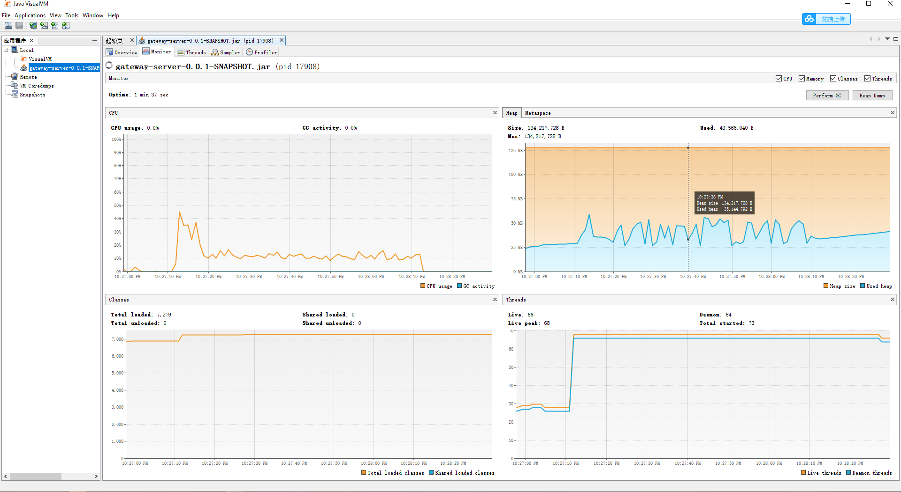
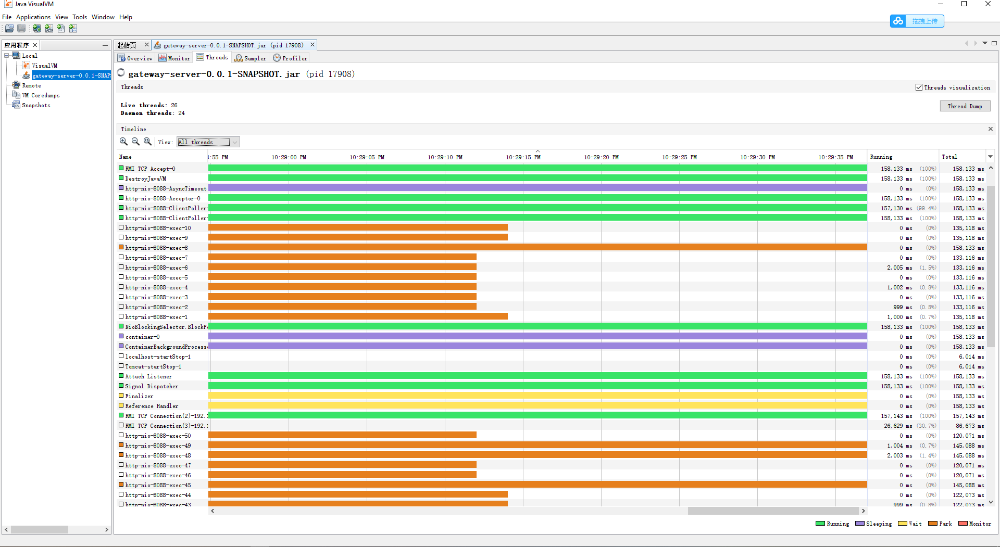

# 学习笔记

## GC 日志解读与分析  

### 系统环境

- CPU  Intel i7  8 core
- Memory:  32GB
- OS: Win10-64bit
- Java Version: JDK1.8.0-181 64bit

### GCLogAnalysis

#### java -XX:+PrintGCDetails GCLogAnalysis

- -Xloggc:gc.demo.log, 输出到指定的日志文件
- -XX:+PrintGCDateStamps， 打印时间戳。

- 默认分配了8G堆 （总内存的1/4）， 初始堆内存512M

  默认为参数：（这一点可以通过 -Xloggc:gc.demo.log 输出的 log 看到）

  ```
  CommandLine flags: -XX:InitialHeapSize=535569088 -XX:MaxHeapSize=8569105408 -XX:+PrintGC -XX:+PrintGCDateStamps -XX:+PrintGCDetails -XX:+PrintGCTimeStamps -XX:+UseCompressedClassPointers -XX:+UseCompressedOops -XX:-UseLargePagesIndividualAllocation -XX:+UseParallelGC 
  ```

- 最开始Young GC， Young 128M Minar GC后变为20M左右，堆内存128变为40+M， 总可用堆内存为512M

  ````
  2020-10-27T21:20:23.891+0800: 0.158: [GC (Allocation Failure) [PSYoungGen: 131584K->21497K(153088K)] 131584K->49981K(502784K), 0.0072551 secs] [Times: user=0.01 sys=0.02, real=0.01 secs]
  ````

- 5次Young GC 之后发生了Full GC。

  Young此时已经升级到512M（全部Young清0）， Old区从358,251K 降低到273,027K 可用大小512M， 总堆可用内存升级到1G.

  FULL GC 用时0.04秒

  ```
  2020-10-27T21:20:24.180+0800: 0.447: [Full GC (Ergonomics) [PSYoungGen: 547832K->0K(547840K)] [ParOldGen: 358251K->273027K(540160K)] 906084K->273027K(1088000K), [Metaspace: 2667K->2667K(1056768K)], 0.0351989 secs] [Times: user=0.25 sys=0.00, real=0.04 secs] 
  ```

-  最后堆内存

  ```
  - PSYoungGen      total 1437696K, used 1420978K  
      eden space 1227776K, 98% used
      from space 209920K, 99% used 
      to   space 282624K, 0% used 
  -  ParOldGen       total 712192K, used 356519K
      object space 712192K, 50% used 
  -  Metaspace       used 2673K, capacity 4486K, committed 4864K, reserved 1056768K
      class space    used 287K, capacity 386K, committed 512K, reserved 1048576K
  ```

#### java -Xmx128m -XX:+PrintGCDetails GCLogAnalysis  

- Young 区一开始30~M vs Old 80~M, 一段young GC之后Old不够用，Young区降低到28~M。然后Old还是不够用，一直Full GC直到Out of Memory

- Heap

   ```
  PSYoungGen      total 29184K, used 14816K
    eden space 14848K, 99% used 
    from space 14336K, 0% used
    to   space 14336K, 0% used
   ParOldGen       total 87552K, used 87119K
    object space 87552K, 99% used 
   Metaspace       used 2698K, capacity 4486K, committed 4864K, reserved 1056768K
    class space    used 290K, capacity 386K, committed 512K, reserved 1048576K
  ```

#### java -XX:+UseSerialGC -Xms512m -Xmx512m  -XX:+PrintGCDetails -XX:+PrintGCDateStamps GCLogAnalysis

- 串行 Young GC

  ```
  2020-10-27T21:57:52.502+0800: [GC (Allocation Failure) 2020-10-27T21:57:52.502+0800: [DefNew: 139776K->17472K(157248K), 0.0193585 secs] 139776K->45127K(506816K), 0.0200322 secs] [Times: user=0.02 sys=0.00, real=0.02 secs]
  ```

- Full GC

  ```
  2020-10-27T21:57:52.809+0800: [GC (Allocation Failure) 2020-10-27T21:57:52.810+0800: [DefNew: 157150K->157150K(157248K), 0.0004916 secs]2020-10-27T21:57:52.810+0800: [Tenured: 330683K->273106K(349568K), 0.0336288 secs] 487834K->273106K(506816K), [Metaspace: 2667K->2667K(1056768K)], 0.0350496 secs] [Times: user=0.05 sys=0.00, real=0.04 secs]
  ```

#### java -XX:+UseParallelGC -Xms512m -Xmx512m   -XX:+PrintGCDetails -XX:+PrintGCDateStamps GCLogAnalysis  

- Young GC

  `2020-10-27T22:03:54.322+0800: [GC (Allocation Failure) [PSYoungGen: 131257K->21491K(153088K)] 131257K->44672K(502784K), 0.0062654 secs] [Times: user=0.00 sys=0.13, real=0.01 secs]`

- Full GC

  `2020-10-27T22:03:54.497+0800: [Full GC (Ergonomics) [PSYoungGen: 42975K->0K(116736K)] [ParOldGen: 293378K->235080K(349696K)] 336353K->235080K(466432K), [Metaspace: 2667K->2667K(1056768K)], 0.0284635 secs] [Times: user=0.14 sys=0.00, real=0.03 secs]`

  

#### java -XX:+UseConcMarkSweepGC -Xms512m -Xmx512m   -XX:+PrintGCDetails -XX:+PrintGCDateStamps GCLogAnalysis  

- Young GC

  `2020-10-27T22:06:32.537+0800: [GC (Allocation Failure) 2020-10-27T22:06:32.537+0800: [ParNew: 139776K->17472K(157248K), 0.0074563 secs] 139776K->52644K(506816K), 0.0079545 secs] [Times: user=0.00 sys=0.00, real=0.01 secs]`

- Concurrency Mark Sweep

  ```
  2020-10-27T22:06:32.682+0800: [GC (CMS Initial Mark) [1 CMS-initial-mark: 205407K(349568K)] 225947K(506816K), 0.0005467 secs] [Times: user=0.00 sys=0.00, real=0.00 secs]
  2020-10-27T22:06:32.683+0800: [CMS-concurrent-mark-start]
  2020-10-27T22:06:32.684+0800: [CMS-concurrent-mark: 0.001/0.001 secs] [Times: user=0.00 sys=0.00, real=0.00 secs]
  2020-10-27T22:06:32.684+0800: [CMS-concurrent-preclean-start]
  2020-10-27T22:06:32.685+0800: [CMS-concurrent-preclean: 0.000/0.000 secs] [Times: user=0.00 sys=0.00, real=0.00 secs]
  2020-10-27T22:06:32.685+0800: [CMS-concurrent-abortable-preclean-start]
  ...
  2020-10-27T22:06:32.789+0800: [CMS-concurrent-abortable-preclean: 0.002/0.103 secs] [Times: user=0.53 sys=0.03, real=0.10 secs]
  2020-10-27T22:06:32.789+0800: [GC (CMS Final Remark) [YG occupancy: 20686 K (157248 K)]2020-10-27T22:06:32.789+0800: [Rescan (parallel) , 0.0003886 secs]2020-10-27T22:06:32.790+0800: [weak refs processing, 0.0000950 secs]2020-10-27T22:06:32.790+0800: [class unloading, 0.0002442 secs]2020-10-27T22:06:32.790+0800: [scrub symbol table, 0.0003399 secs]2020-10-27T22:06:32.790+0800: [scrub string table, 0.0001750 secs][1 CMS-remark: 342096K(349568K)] 362783K(506816K), 0.0016180 secs] [Times: user=0.00 sys=0.00, real=0.00 secs]
  2020-10-27T22:06:32.791+0800: [CMS-concurrent-sweep-start]
  2020-10-27T22:06:32.791+0800: [CMS-concurrent-sweep: 0.001/0.001 secs] [Times: user=0.00 sys=0.00, real=0.00 secs]
  2020-10-27T22:06:32.792+0800: [CMS-concurrent-reset-start]
  2020-10-27T22:06:32.792+0800: [CMS-concurrent-reset: 0.001/0.001 secs] [Times: user=0.00 sys=0.00, real=0.00 secs]
  2020-10-27T22:06:32.804+0800: [GC (Allocation Failure) 2020-10-27T22:06:32.805+0800: [ParNew: 157246K->157246K(157248K), 0.0001612 secs]2020-10-27T22:06:32.805+0800: [CMS: 294984K->264864K(349568K), 0.0316876 secs] 452230K->264864K(506816K), [Metaspace: 2667K->2667K(1056768K)], 0.0322720 secs] [Times: user=0.03 sys=0.00, real=0.03 secs]
  ```

- Heap

  ```
   par new generation   total 157248K, used 9596K 
    eden space 139776K,   6% used 
    from space 17472K,   0% used 
    to   space 17472K,   0% used
   concurrent mark-sweep generation total 349568K, used 349261K 
   Metaspace       used 2673K, capacity 4486K, committed 4864K, reserved 1056768K
    class space    used 287K, capacity 386K, committed 512K, reserved 1048576K
  2020-10-27T22:06:33.489+0800: [CMS-concurrent-mark: 0.001/0.001 secs] [Times: user=0.00 sys=0.00, real=0.00 secs]
  ```

#### java -XX:+UseG1GC -Xms512m -Xmx512m   -XX:+PrintGCDetails -XX:+PrintGCDateStamps GCLogAnalysis  

- GC 暂时没太看懂，稍后研究。

```
2020-10-27T22:14:42.263+0800: [GC pause (G1 Evacuation Pause) (mixed) (to-space exhausted), 0.0048540 secs]
   [Parallel Time: 3.2 ms, GC Workers: 8]
      [GC Worker Start (ms): Min: 1073.8, Avg: 1073.8, Max: 1073.9, Diff: 0.1]
      [Ext Root Scanning (ms): Min: 0.0, Avg: 0.1, Max: 0.1, Diff: 0.1, Sum: 0.7]
      [Update RS (ms): Min: 0.4, Avg: 0.4, Max: 0.4, Diff: 0.0, Sum: 2.9]
         [Processed Buffers: Min: 5, Avg: 6.5, Max: 8, Diff: 3, Sum: 52]
      [Scan RS (ms): Min: 0.0, Avg: 0.0, Max: 0.0, Diff: 0.0, Sum: 0.1]
      [Code Root Scanning (ms): Min: 0.0, Avg: 0.0, Max: 0.0, Diff: 0.0, Sum: 0.0]
      [Object Copy (ms): Min: 2.5, Avg: 2.6, Max: 2.6, Diff: 0.0, Sum: 20.4]
      [Termination (ms): Min: 0.0, Avg: 0.0, Max: 0.0, Diff: 0.0, Sum: 0.1]
         [Termination Attempts: Min: 1, Avg: 1.0, Max: 1, Diff: 0, Sum: 8]
      [GC Worker Other (ms): Min: 0.0, Avg: 0.0, Max: 0.0, Diff: 0.0, Sum: 0.1]
      [GC Worker Total (ms): Min: 3.0, Avg: 3.1, Max: 3.1, Diff: 0.1, Sum: 24.4]
      [GC Worker End (ms): Min: 1076.9, Avg: 1076.9, Max: 1076.9, Diff: 0.0]
   [Code Root Fixup: 0.0 ms]
   [Code Root Purge: 0.0 ms]
   [Clear CT: 0.4 ms]
   [Other: 1.3 ms]
      [Evacuation Failure: 0.2 ms]
      [Choose CSet: 0.0 ms]
      [Ref Proc: 0.3 ms]
      [Ref Enq: 0.0 ms]
      [Redirty Cards: 0.4 ms]
      [Humongous Register: 0.1 ms]
      [Humongous Reclaim: 0.0 ms]
      [Free CSet: 0.0 ms]
   [Eden: 21.0M(21.0M)->0.0B(21.0M) Survivors: 4096.0K->4096.0K Heap: 394.1M(512.0M)->365.5M(512.0M)]
 [Times: user=0.03 sys=0.01, real=0.01 secs]
```

- Heap, 总可用512M， 占用374,237K, Region Size 1M，  

  5 young?,  4 suvivors?

  ```
  garbage-first heap   total 524288K, used 374237K  
    region size 1024K, 5 young (5120K), 4 survivors (4096K)
   Metaspace       used 2673K, capacity 4486K, committed 4864K, reserved 1056768K
    class space    used 287K, capacity 386K, committed 512K, reserved 1048576K
  ```

  

### java -jar  -Xmx128m  - .\gateway-server-0.0.1-SNAPSHOT.jar

sb -u http://localhost:8088/api/hello -c 50 -N 60






## HTTP Call

### HttpClent

- Host

  ```
  PS C:\Users\Rn\github\JAVA-000\Week_02\files> java -jar -XX:+PrintGC .\gateway-server-0.0.1-SNAPSHOT.jar
  [GC (Allocation Failure)  131584K->7751K(502784K), 0.0056363 secs]
  
    .   ____          _            __ _ _
   /\\ / ___'_ __ _ _(_)_ __  __ _ \ \ \ \
  ( ( )\___ | '_ | '_| | '_ \/ _` | \ \ \ \
   \\/  ___)| |_)| | | | | || (_| |  ) ) ) )
    '  |____| .__|_| |_|_| |_\__, | / / / /
   =========|_|==============|___/=/_/_/_/
   :: Spring Boot ::        (v2.0.4.RELEASE)
  
  [GC (Metadata GC Threshold)  131565K->11530K(502784K), 0.0106560 secs]
  [Full GC (Metadata GC Threshold)  11530K->10899K(359424K), 0.0214205 secs]
  [GC (Allocation Failure)  142483K->17710K(359424K), 0.0047971 secs]
  [GC (Allocation Failure)  149294K->24217K(410112K), 0.0072191 secs]
  [GC (Metadata GC Threshold)  175819K->26533K(415744K), 0.0111645 secs]
  [Full GC (Metadata GC Threshold)  26533K->20087K(536064K), 0.0529089 secs]
  ```

- Code

  ```
  package io.http;
  
  import org.apache.http.HttpEntity;
  import org.apache.http.client.methods.CloseableHttpResponse;
  import org.apache.http.client.methods.HttpGet;
  import org.apache.http.impl.client.CloseableHttpClient;
  import org.apache.http.impl.client.HttpClients;
  import org.apache.http.util.EntityUtils;
  
  public class HttpClientEg {
      public static void main(String[] args) throws Exception{
          CloseableHttpClient httpclient = HttpClients.createDefault();
          HttpGet httpGet = new HttpGet("http://localhost:8088/api/hello");
          CloseableHttpResponse response = httpclient.execute(httpGet);
          try {
              HttpEntity responseEntity = response.getEntity();
              System.out.println("响应状态为:" + response.getStatusLine());
              if (responseEntity != null) {
                  System.out.println("响应内容长度为:" + responseEntity.getContentLength());
                  System.out.println("响应内容为:" + EntityUtils.toString(responseEntity));
              }
          } finally {
              response.close();
          }
  
      }
  }
  ```

- Result:

  ```
  响应状态为:HTTP/1.1 200 
  响应内容长度为:11
  响应内容为:hello world
  
  Process finished with exit code 0
  ```

  


